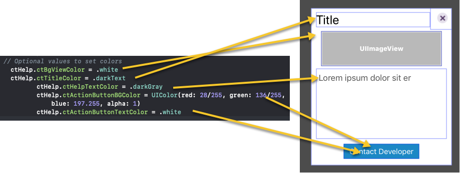
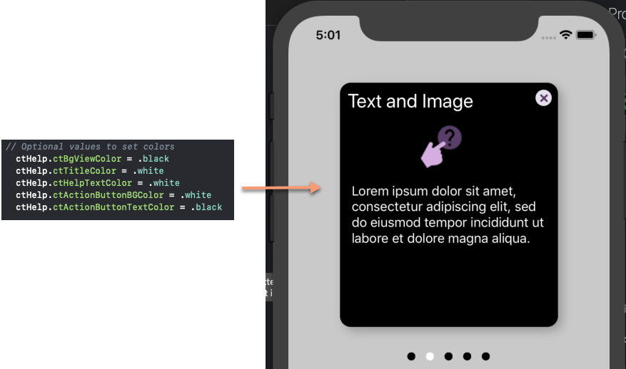
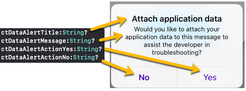
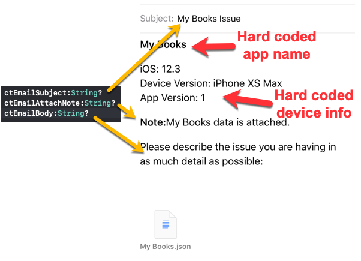

# CTHelp

[](https://travis-ci.org/StewartLynch/CTHelp)
[](https://cocoapods.org/pods/CTHelp)
[](https://cocoapods.org/pods/CTHelp)
[](https://cocoapods.org/pods/CTHelp)

## About CTHelp

CTHelp is a Help system for iOS/Swift 4.2+


## Installation

CTHelp is available through [CocoaPods](https://cocoapods.org). To install
it, simply add the following line to your Podfile:

```ruby
pod 'CTHelp'
```

### Quick Start

Add a button to your view and link the action to a function that sets up and presents the CTHelp view controller.

Here is a sample function that will create 3 help cards + 2 defaults (link to web and support email)

**Note**: No images appear until you upload images to your project and replace 'SomeFullSizedImage', 'SomeSmallImage' and 'CompanyLogo' with the corresponding names to your images.

Also, the links to the emailAddress and webSite will be broken until replaced  with valid entries.


```swift
func showCTHelp() {
   let ctHelp = CTHelp()

   // Optional values to set colors
   // ctHelp.ctBgViewColor = .white
   // ctHelp.ctTitleColor = .darkText
   // ctHelp.ctHelpTextColor = .darkGray
   // ctHelp.ctActionButtonBGColor = UIColor(red: 28/255, green: 136/255, blue: 197.255, alpha: 1)
   // ctHelp.ctActionButtonTextColor = .white

   ctHelp.new(CTHelpItem(title:"No Text-Image Only",
                         helpText: "",
                         imageName:"SomeFullSizedImage"))
   ctHelp.new(CTHelpItem(title:"Text and Image",
                         helpText: "Lorem ipsum dolor sit amet, consectetur adipiscing elit, sed do eiusmod tempor incididunt ut labore et dolore magna aliqua.",
                         imageName:"SomeSmallImage"))
   ctHelp.new(CTHelpItem(title:"No Image-Text Only",
                         helpText: "Eu tempor suscipit dis sed. Tortor velit orci bibendum mattis non metus ornare consequat. Condimentum habitasse dictumst eros nibh rhoncus non pulvinar fermentum. Maecenas convallis gravida facilisis. Interdum, conubia lacinia magnis duis nec quisque.Excepteur sint occaecat cupidatat non proident, sunt in culpa qui officia deserunt mollit anim id est laborum.",
                         imageName:""))

 // Optional addition of two default cards
 // Use only if you wish to change the strings presented in the two default cards
   // ctHelp.ctWebButtonTitle = ""
   // ctHelp.ctWebHelpText = ""
   // ctHelp.ctContactTitle = ""
   // ctHelp.ctContactHelpText = ""
   // ctHelp.ctIncludeDataText = ""
   // ctHelp.ctContactButtonTitle = ""

   // Email data
   // ctHelp.ctEmailSubject = ""
   // ctHelp.ctEmailAttachNote = ""
   // ctHelp.ctEmailBody = ""

   // Email alert
   // ctHelp.ctDataAlertTitle = ""
   // ctHelp.ctDataAlertMessage = ""
   // ctHelp.ctDataAlertActionNo = ""
   // ctHelp.ctDataAlertActionYes = ""

   ctHelp.appendDefaults(companyName: "Your Company Name", emailAddress: "yourContactEmail@somewhere.com", data: nil, webSite: "https://www.yourWebsite.com", companyImageName: "CompanyLogo")

   ctHelp.presentHelp(from: self)
}
```

The optional color values let you change each of the 4 different components of the CTHelpView



So uncommenting and changing some or all of the values can change the appearance of your help card.



#### Optional String Values

You may choose to override the strings that are used on the two default cards (web and email contact).  For your reference, here is how they match up. If you do not change the strings, the text will appear as shown with the exception of your company and app name which are passed through with the function call.






## More Documentation:

Read the Medium Blog for full documentation and tips for setting up CTHelp.  Includes link to YouTube Video

[https://medium.com/@stewartlynch/adding-help-to-your-ios-app-7d53053fb563](https://medium.com/@stewartlynch/adding-help-to-your-ios-app-7d53053fb563)

## Author

StewartLynch, slynch@createchsol.com

## License

CTHelp is available under the MIT license. See the LICENSE file for more info.
